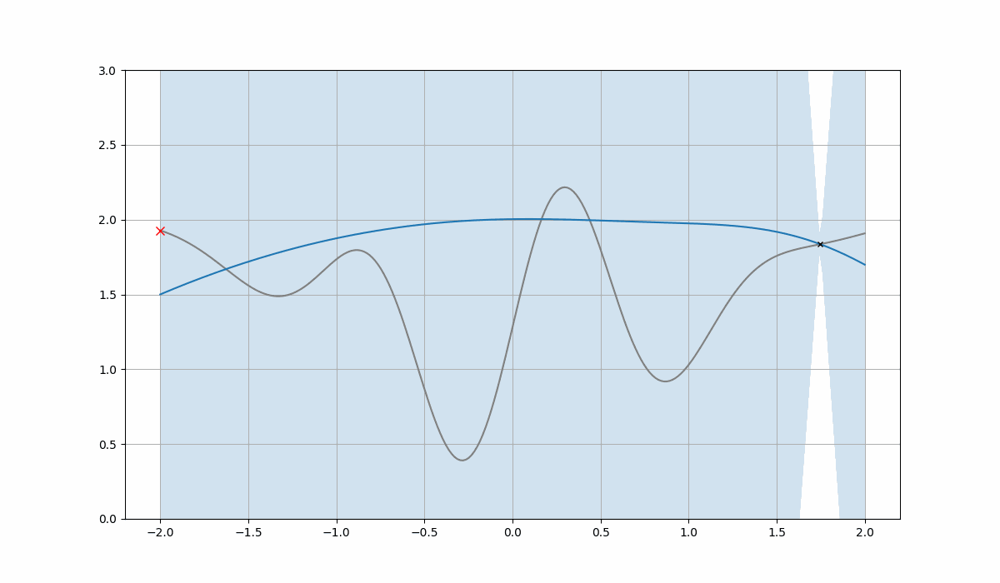

# Variational Bayesian Monte Carlo — From Scratch

A ground-up implementation of **Variational Bayesian Monte Carlo (VBMC)**, built through a series of notebooks that develop each required component from first principles. The project begins with Gaussian Process regression, progresses through Bayesian Quadrature, and ends in a full VBMC implementation that performs tractable posterior inference under expensive likelihoods.

---

## Structure

```
.
├── notebooks/
│   ├── 01_gaussian_process.ipynb          # GP regression & active learning
│   ├── 02_quadrature_univariate.ipynb     # Bayesian Quadrature (univariate)
│   ├── 03_quadrature_multivariate.ipynb   # Bayesian Quadrature (multivariate)
│   ├── 04_VBMC.ipynb                      # Full VBMC implementation
│   ├── gp_utils.py                        # GP inference utilities
│   ├── quad_utils.py                      # Quadrature utilities
│   └── vbmc_utils.py                      # VBMC components
├── figures/
│   ├── gp_animation.gif
│   ├── bivariate_vbmc_animation.gif
│   └── 4d_vbmc_animation.gif
├── derivations.ipynb                      # Mathematical derivations
├── VBMC_components.md                     # Annotated breakdown of VBMC internals
└── requirements.txt
```

---

## Notebooks

### 1 — Gaussian Process Regression

Introduces GP regression from scratch in both the univariate and multivariate settings. Covers kernel functions, posterior inference, predictive uncertainty, and sequential active learning via a maximum-variance acquisition function. Rank-one kernel inverse updates are used for efficiency.

<p align="center">
  
</p>

---

### 2 — Bayesian Quadrature (Univariate)

Frames numerical integration as a problem of Bayesian inference. The integrand is modelled as a Gaussian Process, turning the integral itself into a random variable with a computable posterior mean and variance. Covers integration under Gaussian and Gaussian mixture input distributions, with comparison against Monte Carlo baselines.

---

### 3 — Bayesian Quadrature (Multivariate)

Extends Bayesian Quadrature to higher dimensions, working directly with multivariate Gaussian mixture measures. Derives closed-form kernel expectations and computes posterior uncertainty for multivariate integrals, again validated against Monte Carlo estimates.

---

### 4 — Variational Bayesian Monte Carlo

Brings all components together into a complete VBMC implementation. The algorithm jointly optimises a variational Gaussian mixture approximation to the posterior while refining a GP surrogate for the log-likelihood, selecting new evaluation points via an acquisition function that balances surrogate uncertainty, variational density, and expected improvement.

The ELBO and ELCBO are tracked throughout to monitor convergence. The mixture structure adapts dynamically. Components are added and pruned as the approximation matures. A warm-up phase encourages broad initial exploration before transitioning to stable optimisation.


<p align="center">
  
</p>

A detailed walkthrough of the internal components (initialisation, GP setup, ELBO construction, acquisition, and mixture adaptation) is provided in [`VBMC_components.md`](VBMC_components.md). Mathematical derivations supporting the quadrature results are collected in [`derivations.ipynb`](derivations.ipynb).

---

## Key Dependencies

| Package | Role |
|---------|------|
| `jax` | Automatic differentiation and array operations |
| `emcee` | MCMC sampling for GP hyperparameters |
| `cma` | CMA-ES optimiser for acquisition function |

Install all dependencies with:

```bash
pip install -r requirements.txt
```

---

## Background

VBMC ([Acerbi, 2018](https://arxiv.org/abs/1810.05558)) targets the common setting where the likelihood is expensive to evaluate and standard MCMC is impractical. It replaces direct likelihood evaluations with a GP surrogate and uses Bayesian Quadrature to compute the ELBO in closed form, enabling efficient variational inference with a very small number of likelihood calls.

This implementation is built from scratch using JAX for all gradient-based optimisation and follows the structure of the original algorithm closely, with particular attention to the coupled feedback between the surrogate model, variational approximation, and active sampling strategy.
